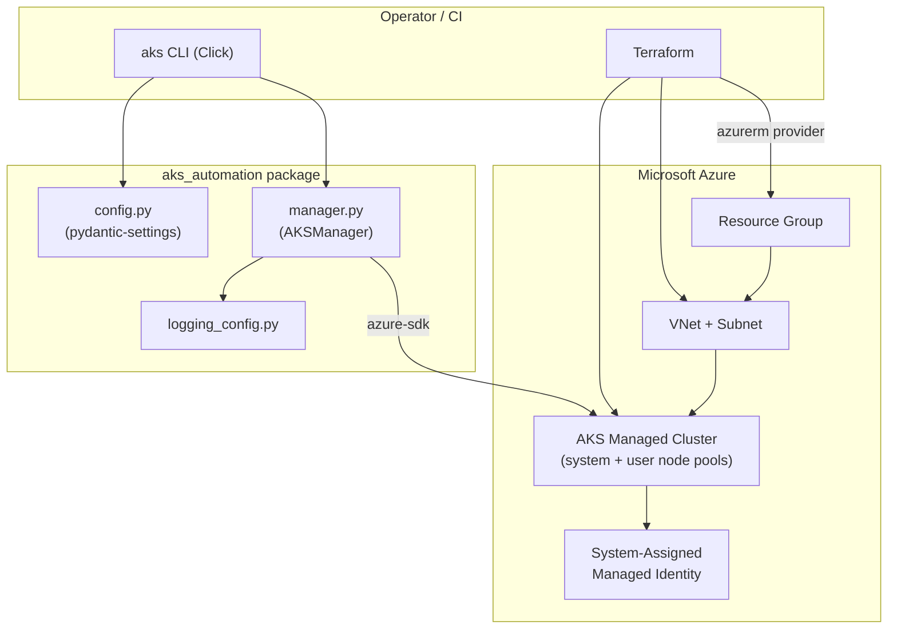

# AKS Automation

Typed Azure SDK toolkit, CLI, and Terraform infrastructure for provisioning and
operating **Azure Kubernetes Service (AKS)** clusters.

[](LICENSE)
[](https://github.com/abhisheksawant52/aks-automation/actions/workflows/ci.yml)
[](https://www.python.org/downloads/)
[](https://developer.hashicorp.com/terraform)

## Overview

AKS Automation brings the two halves of an AKS platform together in one
repository: declarative **infrastructure** (Terraform) and imperative **day-two
operations** (a Python CLI). Terraform stands up the resource group, virtual
network, and cluster with a system-assigned managed identity; the `aks` CLI then
handles the operational lifecycle — creating, inspecting, scaling, upgrading, and
deleting clusters, and fetching kubeconfig credentials — through a small, typed
wrapper around the official Azure SDK for Python.

It is aimed at platform and DevOps engineers who want a coherent, reviewable
baseline for managing AKS across `dev` and `prod` environments without hand-
crafting `az aks` incantations. The Python layer is fully type-hinted, uses
`pydantic-settings` for configuration, and raises explicit, catchable errors for
the common not-found and misconfiguration cases.

The repository is intentionally structured like a production project: a
`src/`-layout package, a Terraform root module with reusable sub-modules,
environment-specific variable sets, CI, pre-commit hooks, and full open-source
hygiene.

## Architecture



**Components**

- **`aks` CLI** — Click-based entry point wired to `AKSManager`.
- **`AKSManager`** — typed façade over `ContainerServiceClient` and
  `ResourceManagementClient` with lazy client construction.
- **Terraform root module** — resource group + `network` and `aks` sub-modules.
- **Environments** — `dev` and `prod` tfvars and partial backend configs.

## Features

- Create, show, list, delete, scale, and upgrade AKS clusters from the CLI.
- Add and scale node pools; fetch user or cluster-admin kubeconfig.
- System-assigned managed identity — no service principal secrets to rotate.
- Optional cluster autoscaler and Azure Monitor / Log Analytics integration.
- Reusable Terraform `network` and `aks` modules with `dev`/`prod` environments.
- `pydantic-settings` configuration via env vars or `.env`, plus structured logging.
- CI (lint, test matrix, `terraform validate`), pre-commit hooks, and a slim CLI image.

## Tech Stack

| Layer            | Technology                                                        |
| ---------------- | ----------------------------------------------------------------- |
| Language         | Python 3.11+                                                      |
| Azure SDK        | `azure-identity`, `azure-mgmt-containerservice`, `azure-mgmt-resource` |
| CLI              | `click`                                                          |
| Config           | `pydantic-settings`                                              |
| Infrastructure   | Terraform (`hashicorp/azurerm`)                                  |
| Tooling          | ruff, black, pytest, pre-commit                                 |
| CI / Packaging   | GitHub Actions, Docker                                          |

## Getting Started

### Prerequisites

| Tool      | Minimum Version |
| --------- | --------------- |
| Python    | 3.11            |
| Terraform | 1.5             |
| Azure CLI | 2.60            |
| kubectl   | 1.29            |

An Azure subscription with quota for the chosen VM size is required.

### Install

```bash
git clone https://github.com/abhisheksawant52/aks-automation.git
cd aks-automation
make install          # pip install -e ".[dev]"
```

### Configure

Copy `.env.example` to `.env` and fill in your values (or export the variables):

```bash
cp .env.example .env
export AZURE_SUBSCRIPTION_ID="<subscription-id>"
az login
```

### Run the CLI

```bash
aks --help

# Create a cluster
aks create -g my-rg -n my-cluster --location eastus --node-count 3

# Inspect and scale
aks list
aks show -g my-rg -n my-cluster
aks scale -g my-rg -n my-cluster --node-pool workload --node-count 5

# Upgrade and fetch credentials
aks upgrade -g my-rg -n my-cluster --kubernetes-version 1.30.0
aks credentials -g my-rg -n my-cluster --output-file ./kubeconfig
```

### Provision infrastructure

```bash
cd terraform
terraform init
terraform plan  -var-file=environments/dev/terraform.tfvars
terraform apply -var-file=environments/dev/terraform.tfvars
```

## Project Structure

```
aks-automation/
├── src/aks_automation/
│   ├── __init__.py          # package + __version__
│   ├── config.py            # pydantic-settings Settings
│   ├── logging_config.py    # logging setup
│   ├── exceptions.py        # typed error hierarchy
│   ├── manager.py           # AKSManager (Azure SDK wrapper)
│   └── cli.py               # `aks` Click CLI
├── tests/                   # pytest unit tests
├── terraform/
│   ├── versions.tf          # required_providers + backend
│   ├── providers.tf         # azurerm provider
│   ├── main.tf              # root module (rg + modules)
│   ├── variables.tf
│   ├── outputs.tf
│   ├── terraform.tfvars.example
│   ├── modules/
│   │   ├── network/         # VNet + subnet
│   │   └── aks/             # cluster + user node pool
│   └── environments/        # dev / prod tfvars + backend.hcl
├── kubernetes/              # sample workload manifest
├── ansible/                 # optional node config playbook
├── .github/workflows/       # ci.yml + aks-deploy.yml
├── Dockerfile               # slim CLI image
├── Makefile
└── pyproject.toml
```

## Configuration

Settings load from keyword args, environment variables (`AKS_` prefix), then a
`.env` file. See `.env.example`.

| Variable                 | Default                   | Description                                  |
| ------------------------ | ------------------------- | -------------------------------------------- |
| `AZURE_SUBSCRIPTION_ID`  | —                         | Azure subscription ID (required for calls)   |
| `AKS_RESOURCE_GROUP`     | `aks-automation-rg`       | Resource group for the cluster               |
| `AKS_LOCATION`           | `eastus`                  | Azure region                                 |
| `AKS_CLUSTER_NAME`       | `aks-automation-cluster`  | Cluster name                                 |
| `AKS_KUBERNETES_VERSION` | latest stable             | Kubernetes version                           |
| `AKS_NODE_COUNT`         | `3`                       | Default node pool size                       |
| `AKS_VM_SIZE`            | `Standard_D2s_v3`         | VM SKU for nodes                             |
| `AKS_DNS_PREFIX`         | cluster name              | DNS prefix for the FQDN                      |
| `AKS_LOG_LEVEL`          | `INFO`                    | Log level                                    |

## Deployment

- **Terraform** — `terraform/` provisions the resource group, VNet/subnet, and
  cluster. Use `environments/dev` and `environments/prod` tfvars, and the
  matching `backend.hcl` for remote state
  (`terraform init -backend-config=environments/prod/backend.hcl`).
- **GitHub Actions** — `.github/workflows/aks-deploy.yml` runs plan-on-PR and
  apply-on-merge for the Terraform stack; `ci.yml` lints, tests, and validates.
- **Container** — build the CLI image with `make docker-build`
  (`docker run --rm aks-automation:latest --help`).
- **Sample workload** — `kubectl apply -f kubernetes/deployment.yaml` after
  fetching credentials.

## Contributing

Contributions are welcome — please read [CONTRIBUTING.md](CONTRIBUTING.md) and
our [Code of Conduct](CODE_OF_CONDUCT.md).

## Security

Please report vulnerabilities as described in [SECURITY.md](SECURITY.md).

## License

Licensed under the [MIT License](LICENSE).
